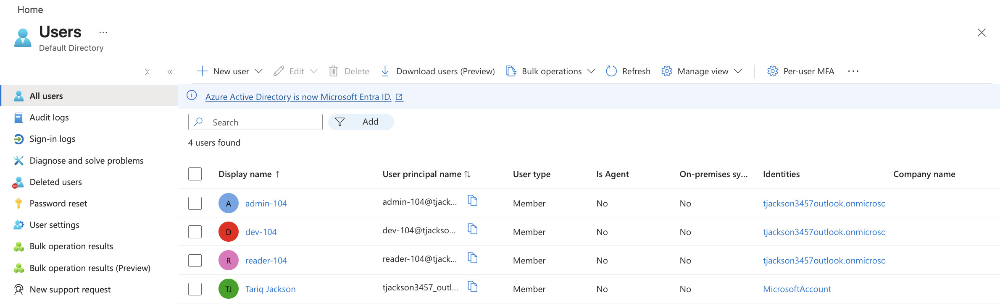
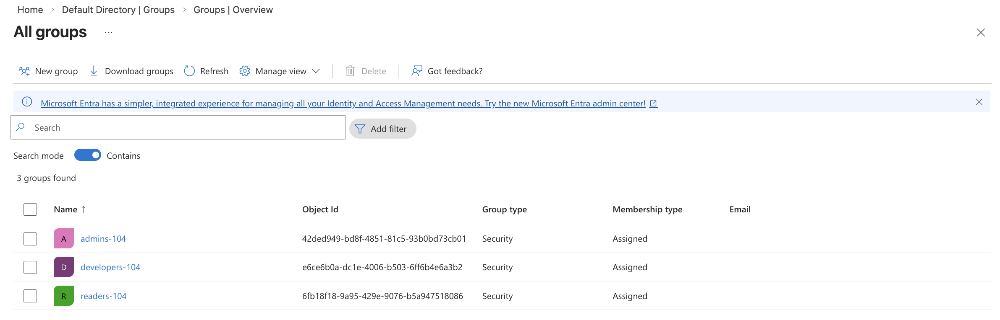
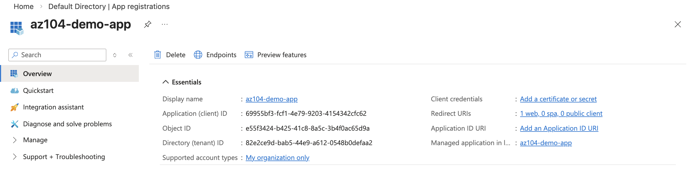
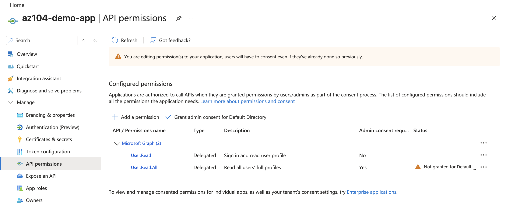
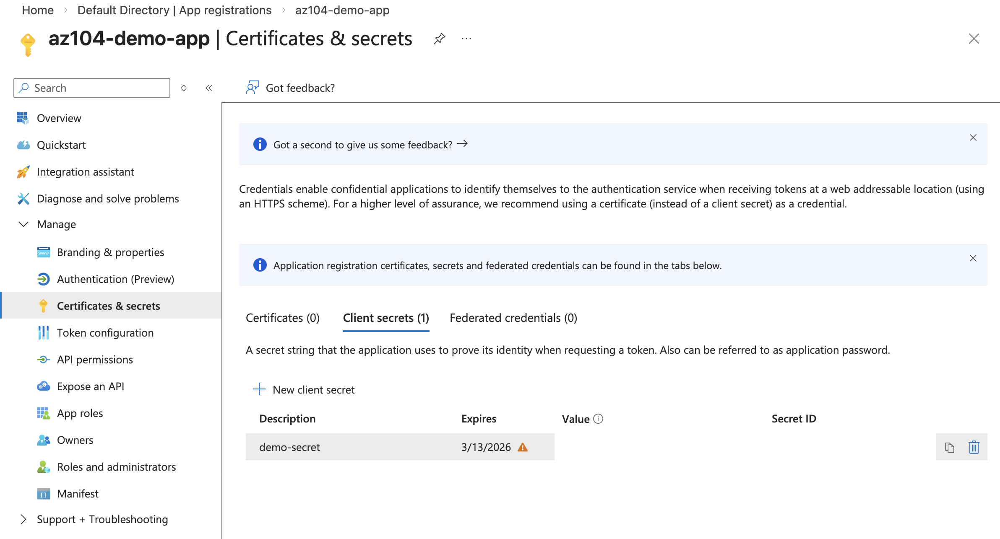
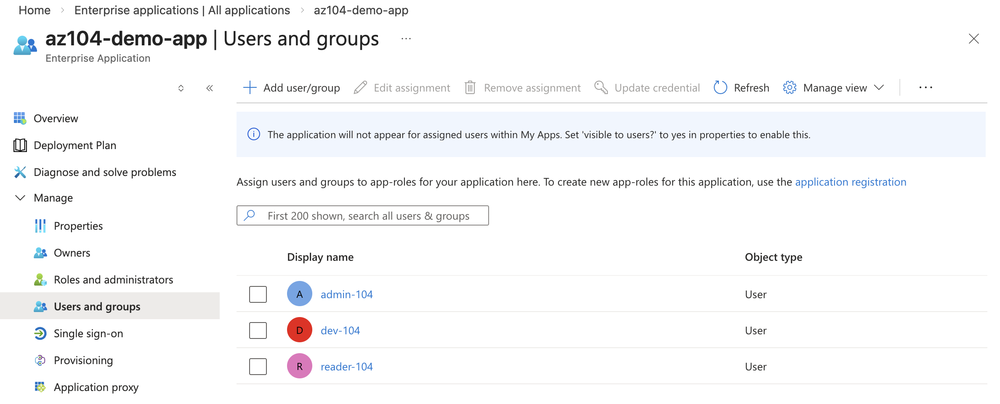
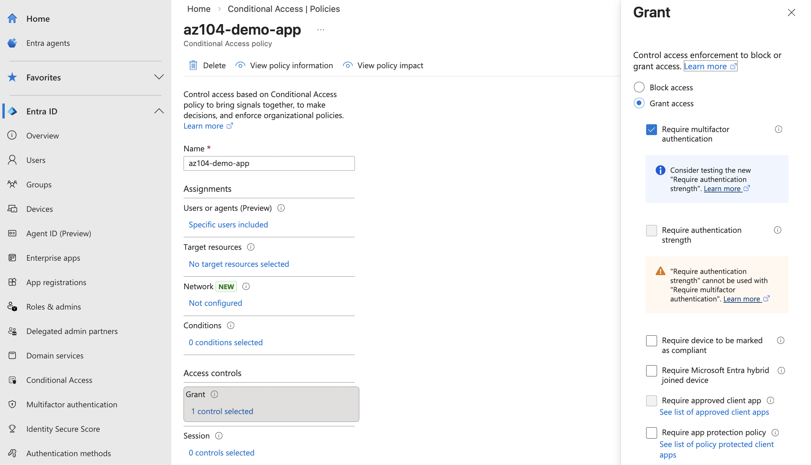
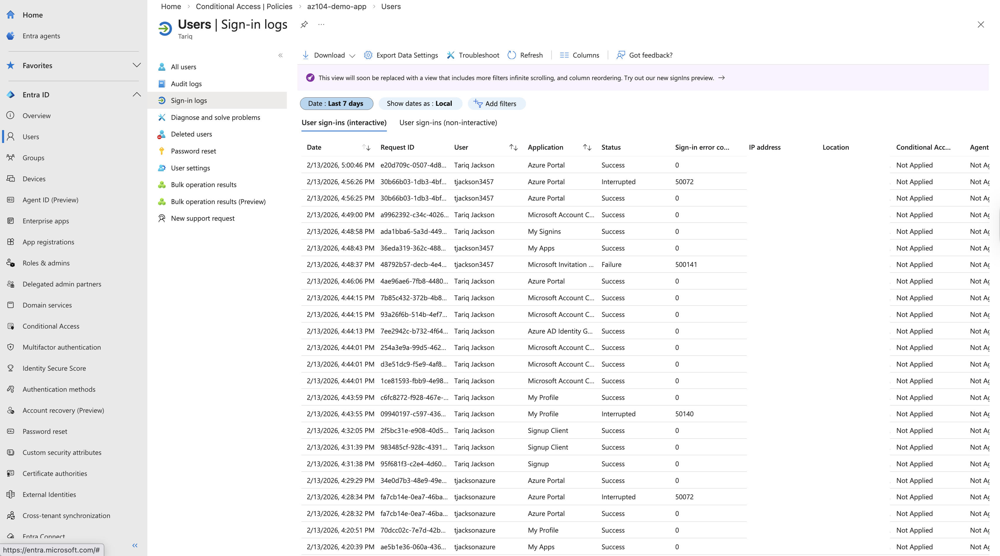

# 🔐 Azure Entra ID Integration & Identity Management

## 📌 Overview
This project demonstrates how to integrate an application with Microsoft Entra ID for authentication and access control. It covers user and group management, app registration, API permissions, Conditional Access (MFA), and sign-in monitoring.

## 🏗 Architecture Overview
- Users authenticate with Microsoft Entra ID  
- Application registered in App Registrations  
- Permissions granted via Microsoft Graph  
- Access controlled using Conditional Access (MFA)  
- Users assigned through Enterprise Applications  
- Authentication activity monitored via Sign-in Logs  

## 🛠 Technologies Used
- Microsoft Entra ID (Azure AD)  
- App Registrations  
- Enterprise Applications  
- Conditional Access (MFA)  
- Microsoft Graph API  
- Azure Portal  

## 1️⃣ Create Users & Groups

## 2️⃣ Register Application in Entra ID

**Application:** `az104-demo-app`

## 3️⃣ Configure API Permissions

Configured Microsoft Graph permissions:
- User.Read  
- User.Read.All  

## 4️⃣ Create Client Secret

## 5️⃣ Assign Users to Enterprise Application

## 6️⃣ Configure Conditional Access (Require MFA)

## 7️⃣ Verify Sign-In Logs

## 🔐 Security Features Demonstrated
- Role-based access control  
- Application authentication  
- Conditional Access policy  
- MFA enforcement  
- Sign-in monitoring  

## 🧠 What This Project Demonstrates
- Real-world Entra ID configuration  
- Identity & Access Management skills  
- Azure security fundamentals  
- Conditional Access & MFA setup  
- Enterprise-ready identity design  
